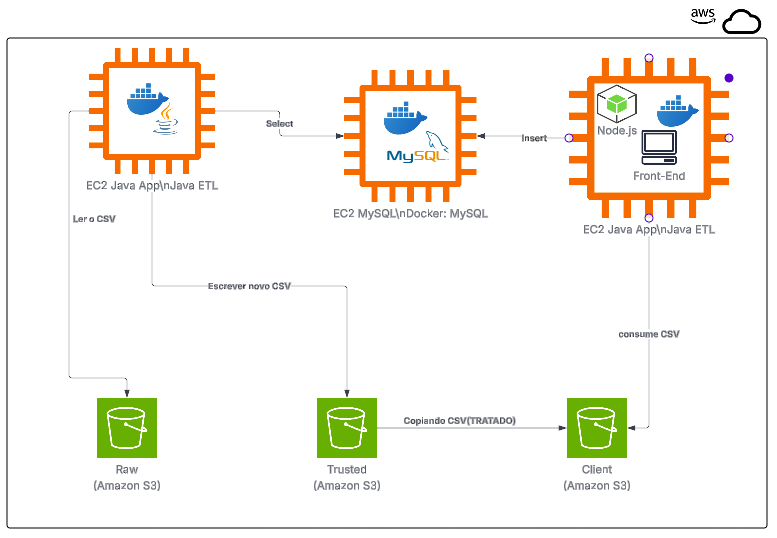

# BlackScreen java
Projeto criado em Java que funciona como um ETL(Extract,Transform e Load).

Que busca tratar informações de um arquivo csv, 
além de fazer comparação de um valor encontrado no banco de dados com os valores guardados em csv. 

Utilizando alugmas bibliotécas uma delas o Lombok, que facilita a criação de Getter e Setter além de Constructor,
que ajuda criar um código mais limpo e escalável. 
Além disso, utilizamos nesse ETL conexão com banco de dados Mysql e criação de metodos de select no banco. 

# Diagrama de Arquitetura

Projeto de PI do segundo semestre de Ciências da Computação da faculdade SPTech.

